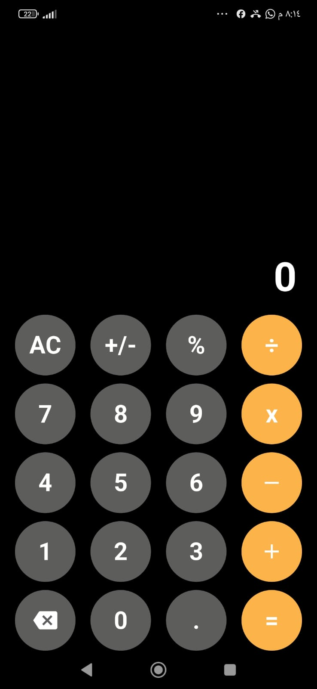

# 🧮 Flutter Calculator

A simple and clean calculator application built with **Flutter** and **Dart**.

This project was created to practice Flutter UI development, state management with `setState`, custom widgets, callbacks, and implementing calculator logic.

## 📱 Preview



## 🎥 Demo

[)

## ✨ Features

* Basic arithmetic operations:

  * Addition `+`
  * Subtraction `-`
  * Multiplication `×`
  * Division `÷`
* Percentage `%`
* Positive / Negative `+/-`
* Decimal numbers
* Clear / Reset `AC`
* Multiple operations in one expression
* Operator precedence
* Division by zero handling
* Clean number formatting

## 🧠 What I Practiced

Through this project, I practiced:

* Flutter Widgets
* `StatefulWidget`
* `setState()`
* Custom Widgets
* Callbacks
* `VoidCallback`
* Passing functions as parameters
* Lists in Dart
* Working with `double`
* Conditional statements and loops
* Implementing arithmetic logic

## 📱 Example

The calculator correctly handles operator precedence.

```text
30 + 15 × 2 ÷ 20 - 4
```

Result:

```text
27.5
```

## 🛠️ Technologies

* Flutter
* Dart

## 🚀 Getting Started

### 1. Clone the repository

```bash
git clone https://github.com/YOUR_USERNAME/flutter_calculator.git
```

### 2. Open the project

```bash
cd flutter_calculator
```

### 3. Get dependencies

```bash
flutter pub get
```

### 4. Run the application

```bash
flutter run
```

## 👨‍💻 Author

**Ziyad Bohdor**

Flutter Developer

